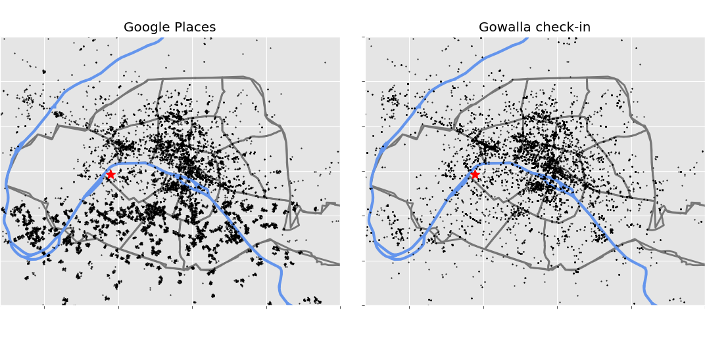

---
title: Jointly analysis of geospatial and friendship of Gowalla data. 
author:
- name: Juan Benjumea
  affiliation: LSCP - Ecole Normal Sup.
  email: jubenjum@gmail.com
date: March 2017
abstract: Gowalla is a location-based social networking website where users share their locations by checking-in. The friendship network is undirected and was collected using their public API, and consists of 196591 nodes and 950327 edges. It has a total of 6,442,890 check-ins of these users over the period of Feb. 2009 - Oct. 2010. The aim of the project is to use Data Science tools to analyse and build a recommendation system for both the geospatial checkins and the social network links in that database. As a part of the project I will  tag a users as a locals or tourists (who mostly visit monuments, stay in hotels ...) and adapt responses given that tag. I will use the 17400 Paris check-ins from 1366 users and I will join Gowalla location data with Google Places to separate the type of venues reported Gowalla's users.

geometry:  margin=2.5cm
header-includes:
    - \usepackage{setspace}
    - \doublespacing

bibliography: biblio.bib 
...

# Introduction - Motivation - Explanation of the context – Your contribution to the project

the authors [@Ference:2013] @Yuan:2013 @wan:2014 @Rahimi:2013 @narayanan:2009 @Zhang:2015 @yuan2016 @Rossi:2014 @Noulas:2012 @Johnson:2017

# Datasets description

Multiple sources of information were used to using in the developing of this project; the 
datasets includes the Stanford's SNAP Gowalla data [@Cho:2011], queries to Google Maps 
API and vectorial geodata from [OpenStreetMaps](http://openstreetmap.fr).

The [Gowalla](https://snap.stanford.edu/data/loc-gowalla.html) is an anonymized and clean dataset 
collected from February 2009 to October 2010 from the Gowalla's startup to capture human 
mobility in a location-based social network (LBSN). In Gowalla LBSN, people were able to 
**check-in** at places or **spots** that they visited near to their local vecinity; Check-ins 
were collected from a mobile application or through a mobile website, the incentive for 
users was to get advantages in the places they check-in[^Gowalla_wiki]. SNAP's Gowalla 
data is splited in two datasets: a) a collection of more that 6.4 millions of individual 
check-ins[^GCheck] and b) an undirected graph[^GGraph] with 196591 nodes and 950327 edges [@Cho:2011]

For this project a subset of the check-in in Gowalla data was extracted; The subset 
correponds to data for Paris, selecting all datapoints in a cicle radious of 30km 
from the position 48.86°N, 2.35°E. The selected data consists in 17496 check-ins between September 2009 and October 2010 [[see github](https://github.com/jubenjum/dssp5-proj/blob/master/data/loc-gowalla_totalCheckins_Paris.txt)].
Data from the undirected graph was not used in this Data Science pipeline given the constrains on 
the selected data as the low number of connections for Paris, searching time, etc.

 
The project's location data was enriched using information fetched from Google Places using their webservice 
API (function [`nearbysearch`](https://developers.google.com/places/web-service/search)). I developped 
scripts to do multiple webscrapping and parsing Google's JSON geodata. 
Paris' Gowalla's data contains 4104 different 
check-ins locations, for each one of those point I searched all the POI (Points of interest) within 
100m radius, and getting a total of 17373 individual POIs. Google's JSON POI contains many fields, for
the DSSP pipeline I extracted a subset containing: `

- `geometry/location`: latitude and longitude, numerical values 
- `id`: location google's hash, 10character string
- `name`: name of the place, a string 
- `type`: a string with one of Google's supported [types](https://developers.google.com/places/supported_types)

{#fig:1}

Google classify their places in 130 types, the full list of supporte types are listed on 
the table +@Table:types_gogle. The location of Gowalla check-ins and Google Places are in the figure +@fig:1

[^Gowalla_wiki]: https://en.wikipedia.org/wiki/Gowalla
[^GCheck]: the data's columns are 1-`user_id`, 2-`UTC_Time`, 3-`latitude`, 4-`longitude` 
           and  5-`spot_id`; 1,3,4 are directly used on the DSSP's workflow; 2 is corrected
           for daysaving time, all variables are available on the dataframes.
[^GGraph]: it contains in the columns `user_id` `friend_id`.

# Exploration and Preprocessing

As mentioned before the raw data was given in multiples formats; Gowalla format consist on fixed width 
the columns, that contains: user identification number, the UTC time of the check-in, the location in i
decimal latitude and logitude,
the las column is the a unique spot id. For these datapoints the only needed modifications done on the data
is on the UTC time, that time was corrected using a daysaving time function, this dataset was alredy clean
for research by SNAP, then no extra modifications were done on this data. 

To obtain Google's Places data, all unique locations from all check-ins in Paris from Gowalla 
dataset were downloaded in a radious of 100m to that point and selectin all type of sites 
(hotel, monuments, zoo, etc).  The total the number check-ins in Gowalla's data is 
17496, however that number is reduced to only 4178 when duplicated are removed. Duplicated data 
was searched from Google's site hash code. 

Google Places webservice returns a JSON file for each query and a maximum of 2500 queries/day per 
developer key, I made 4178 queries in in two daily batches. Both batches were merged on a single  
csv data file containing 30286 POI and 19089 POI after cleaning, the higher number of POI on Google 
Sites in comparison with Gowalla's check-ins is due to Gowalla locations are close one each other, and 
I am looking for an extenced searching radius in Gogle. Looking closely to figure +@fig:1, it can be see
that there are points in Gowalla that are not present on Google Sites and there are more point on Google's, 
this can happened because: 

- The Gowalla spots doesn't exist any more, closed restaurants, shops etc.
- Check-ins in private properties (e.g. appartment, offices)
- Googles Sites were retrived around 100m of GoWalla's data, then there is 
  a higher density of information.

## Analysis of Gowalla data for Paris

From the analysis of 17496 Gowalla check-in locations, the places that are most visited are in 
+@Table:top10 table. The first place corresponds to is the CDG Airport and analysing the data 
it was found that check-in places at the airport correspond to car rental agencies, that could be 
due to promotional coupons or reductions when using the application and doing those check-ins. The other 
9 major check-ins, corresponds to places near-to or in turistical places, that is around 10% of all
the check-ins in Paris, meaning that a proportion of data is given by turists.  

--------------   ---------------------------------
**#Check-ins**   **Place**
--------------   ---------------------------------
   402           CDG Airport
   198           Louvre
   194           Pont des Arts
   171           Eiffel Tower
   267           BNF/François-Mitterrand Library       
   114           Gare du Nord
   106           Notre Dame
   100           A place near to BNF  
    93           Arc de Triomphe
    91           places near to porte de Montreuil    
--------------   ---------------------------------

Table: Top 10 Places in Paris found from Google/Gowalla data. {#Table:top10}

Raw data from Google Places are files stored from calls to Googles Webservce function nearbysearch

Google Places API returning data  

returns a more complex and rich data 

From +@fig:1 it can   

# Feature Engineering/selection and decisions/assumptions you made

# Methods used for learning/prediction

# Analysis and interpretations of the results

difference can be explained on recurrent visit of same people to the same places or different people visiting the same places.

[github repo](https://github.com/jubenjum/dssp5-proj)

Faiss handles collections of vectors of a fixed dimensionality d, typically a few 10s to 100s. These collections can be stored in matrices. We assume row-major storage, ie. the j'th component of vector number $i$ is stored in row $i$, column $j$ of the matrix. Faiss uses only 32-bit floating point matrices.

# Potential further work

\newpage

# Appendices

accounting
pet_store
embassy
taxi_stand
cemetery
storage
light_rail_station
campground
gym
amusement_park
political
funeral_home
natural_feature
courthouse
sublocality_level_3
meal_takeaway
rv_park
insurance_agency
beauty_salon
premise
administrative_area_level_1
pharmacy
establishment
train_station
church
store
liquor_store
car_dealer
hair_care
aquarium
postal_code
furniture_store
neighborhood
dentist
sublocality_level_4
mosque
school
intersection
bicycle_store
real_estate_agency
administrative_area_level_2
physiotherapist
finance
transit_station
city_hall
street_address
local_government_office
car_rental
hardware_store
art_gallery
postal_code_prefix
gas_station
night_club
department_store
sublocality_level_5
movie_rental
shoe_store
jewelry_store
book_store
restaurant
administrative_area_level_3
place_of_worship
fire_station
travel_agency
clothing_store
street_number
locality
car_repair
health
atm
postal_code_suffix
general_contractor
painter
doctor
subpremise
movie_theater
shopping_mall
laundry
bowling_alley
roofing_contractor
administrative_area_level_4
plumber
floor
university
colloquial_area
sublocality
locksmith
car_wash
hindu_temple
bakery
postal_town
geocode
park
electrician
subway_station
moving_company
spa
lawyer
bus_station
room
administrative_area_level_5
point_of_interest
florist
veterinary_care
convenience_store
sublocality_level_1
lodging
casino
home_goods_store
bank
post_box
grocery_or_supermarket
parking
electronics_store
synagogue
museum
stadium
library
cafe
route
airport
police
food
zoo
country
sublocality_level_2
meal_delivery
hospital
bar
post_office

Table: List of returned types on google querey. {#Table:types_gogle}

\newpage

# References

